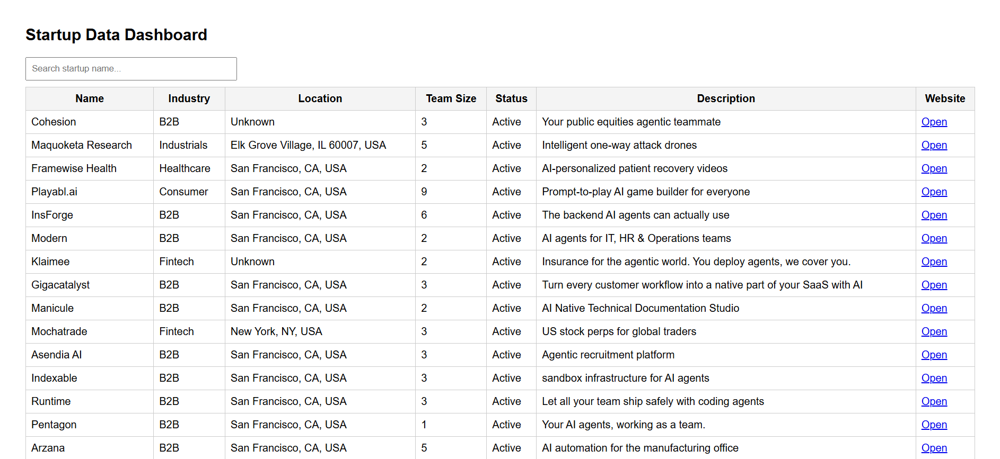
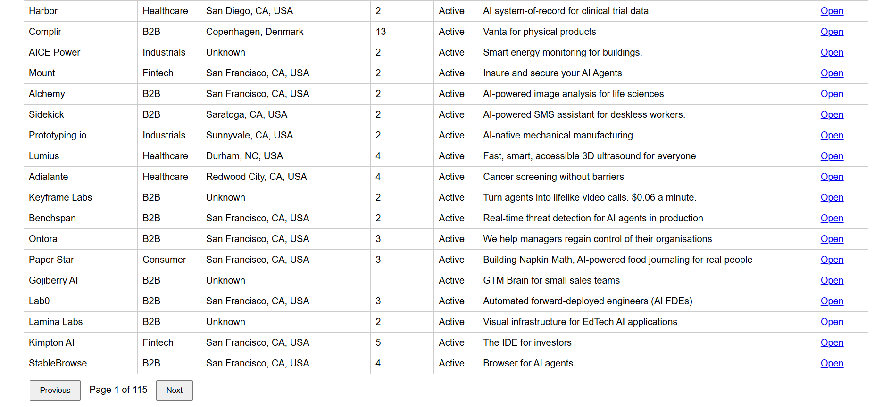
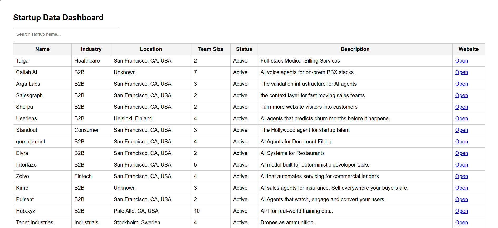
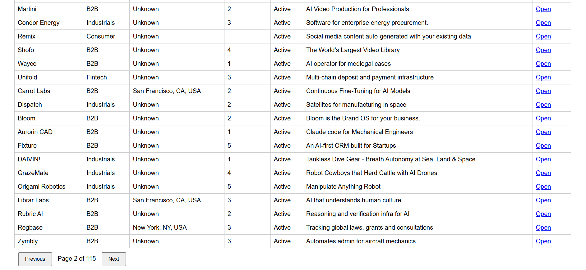

# B2B Startup Data Pipeline

## Overview

This project builds an automated data pipeline that collects startup data from a public source, cleans and standardizes it, stores it in MongoDB, and exposes the data through a dynamic web dashboard and API.

The pipeline runs automatically using a scheduler to keep the data up to date without manual intervention.

---

## Problem Statement

Businesses often need structured information about startups, competitors, and market players, but this data is scattered across multiple sources and not readily available in a clean, usable format.

This project solves that problem by building an automated system that:

- Fetches startup data from a public API
- Cleans and standardizes the data
- Stores it in a database
- Updates automatically using a scheduler
- Provides a dynamic dashboard and API

---

## Architecture

Scraper → Cleaner → Database → Scheduler → API → UI

---

## Features

- Pagination-based scraping
- Missing value handling
- Duplicate prevention
- Automated scheduler
- MongoDB storage
- REST API endpoints
- Dynamic UI dashboard
- Search functionality
- Pagination navigation

---

## Tech Stack

- Python
- FastAPI
- MongoDB Atlas
- Requests
- Schedule
- Jinja2
- HTML / JavaScript

---

## Data Source

https://api.ycombinator.com/v0.1/companies

---

## Setup Instructions

### 1) Install Dependencies

pip install -r requirements.txt

### 2) Create `.env` File

MONGO_URI=your_mongodb_connection_string  
INTERVAL_MINUTES=60

### 3) Run Scheduler

python -m scheduler.scheduler

### 4) Run API Server

python -m uvicorn api.main:app --reload

### 5) Open Application

http://127.0.0.1:8000  

Swagger Docs:

http://127.0.0.1:8000/docs

---

## API Endpoints

GET /

GET /startups?page=1&limit=50

GET /health

---

## Deployment (Render)

Build Command:

pip install -r requirements.txt

Start Command:

uvicorn api.main:app --host 0.0.0.0 --port 10000

Environment Variables:

MONGO_URI  
INTERVAL_MINUTES

---

## Screenshots

